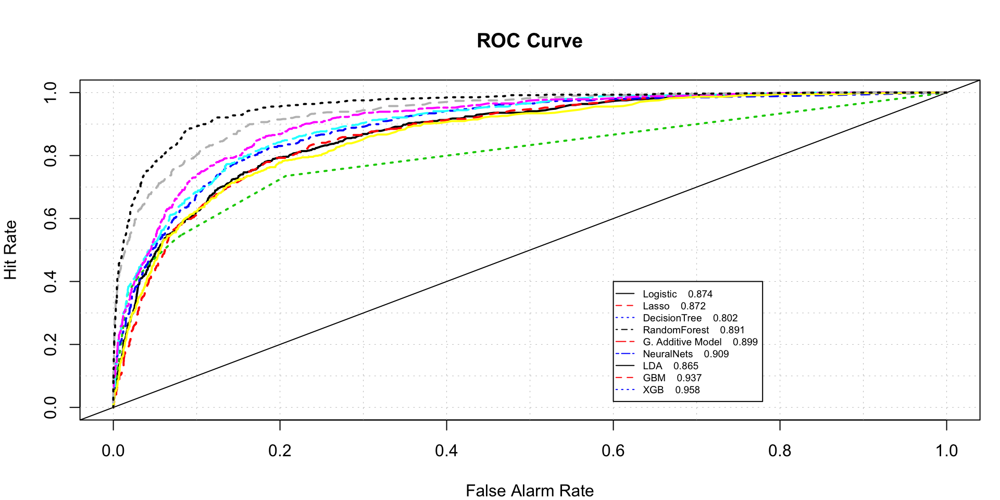
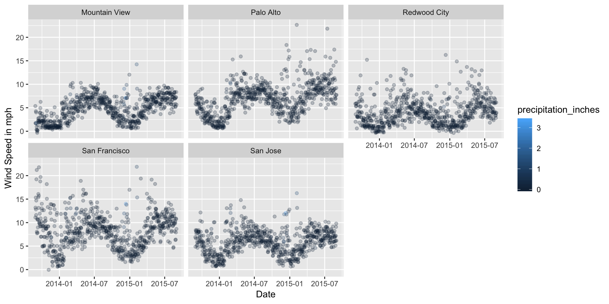

<style type="text/css">
.title {
  display: none;
}

#getting-started img {
  margin-right: 5px;
}
body{ /* Normal  */
      font-size: 18px;
  }
td {  /* Table  */
  font-size: 8px;
}
h1.title {
  font-size: 38px;
  color: DarkRed;
}
h1 { /* Header 1 */
  font-size: 28px;
  color: DarkBlue;
}
h2 { /* Header 2 */
    font-size: 22px;
  color: DarkBlue;
}
h3 { /* Header 3 */
  font-size: 18px;
  font-family: "Times New Roman", Times, serif;
  color: DarkBlue;
}
code.r{ /* Code block */
    font-size: 12px;
}
pre { /* Code block - determines code spacing between lines */
    font-size: 14px;
}

</style>

<div class="row" style="padding-top: 10px;">
<div class="col-sm-7">

## **Project Portfolio**

Hello! I am Swapnil, a Software Engineer turned analytics professional.
I have a graduate degree in Business Analytics and I enjoy solving complex
business problems using data. I love photography and cannot sleep
without watching at least one episode of **The Office!**


### [Connect with me!](http://www.linkedin.com/in/swapnilsp)

</div>

<div class="column-right">


</div>

```{r setup, include=FALSE}
knitr::opts_chunk$set(message=FALSE,warning=FALSE, cache=TRUE)
```

This is a repository of some of the projects I worked on. 

# ML Algorithm benchmarking

This blog is aimed at comparing top machine learning algorithm performance in solving a binary classification problem. The data used for this project pertains to bankruptcy. The objective is to predict if an organization will go bankrupt or not. False possitive predictions are penalized 15 times False negative prediction.



**Following are the alorithms that wil be considered for comparison :**


* **Logistic Regression**
* **Lasso Regression -L1 Norm Regularization**
* **Classification Tree**
* **RandomForest**
* **Generalized Additive Model**
* **Neural Nets**
* **Linear discriminant analysis** 
* **Boosting Algorithms**


<a href="binaryClassification.html">
![contnue reading..]
</a>


# Exploratory Data Analysis

Exploratory data analysis of SF Bay area **[Fordgobike](https://www.fordgobike.com/)** bike share data.

<div>

<div/>


 **Following major steps are discussed :**

* **Data cleaning**
* **Exploratory Data Analysis**
* **Implementation of interactive graphs in R**
* **Embedding Tableau workbooks in R**
* **Geospatial Analysis**
* **Business Recommendations**

<a href="fordGobike.html">
![contnue reading..]
</a>

# Sentiment Analysis of cryptocurrencies

There has been so much buzz about Crypto Currencies and their long-term validity these days. The world has been divided on the credibility of the Crypto Currency as an authentic investment. Some countries have even gone to the extent of banning the trade of Crypto Currencies. Let's explore what Twitterati think about this phenomenon. 

Based on the data available at **[Cryptocurrency Market Capitalizations](https://coinmarketcap.com/)**, top three Crypto Currencies with highest market capitalization were selected for analysis.

<div>

<div/>

Following three Crypto Currencies were selected-

* **Bitcoin (BTC)**
* **Ripple (XRP)**
* **Ethereum (ETH)**

<a href="cryptocurrency.html">
![contnue reading..]
</a>

