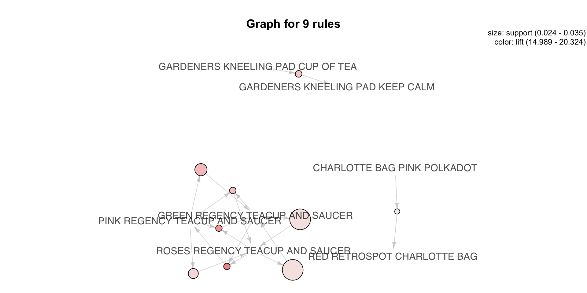
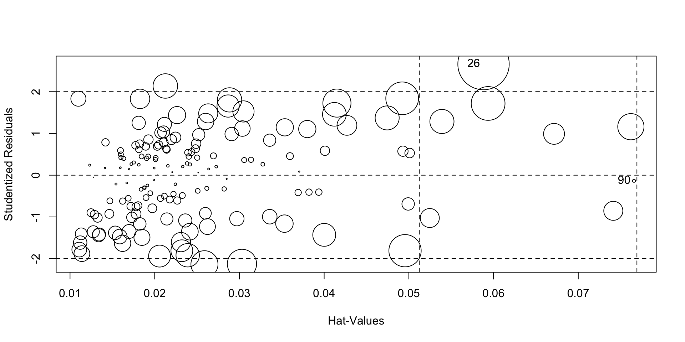
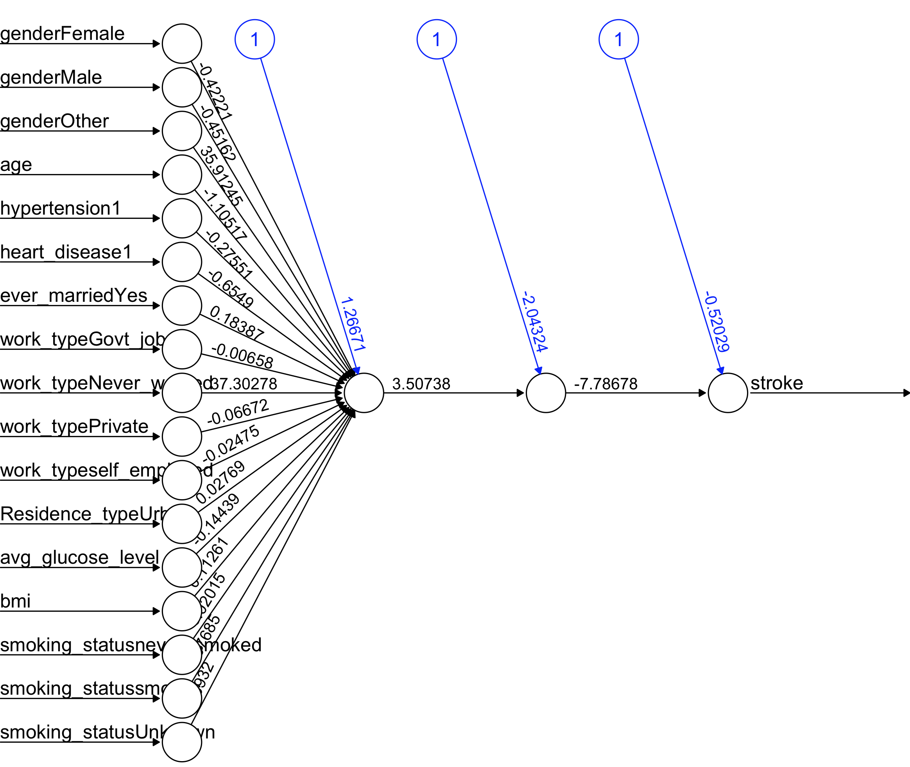
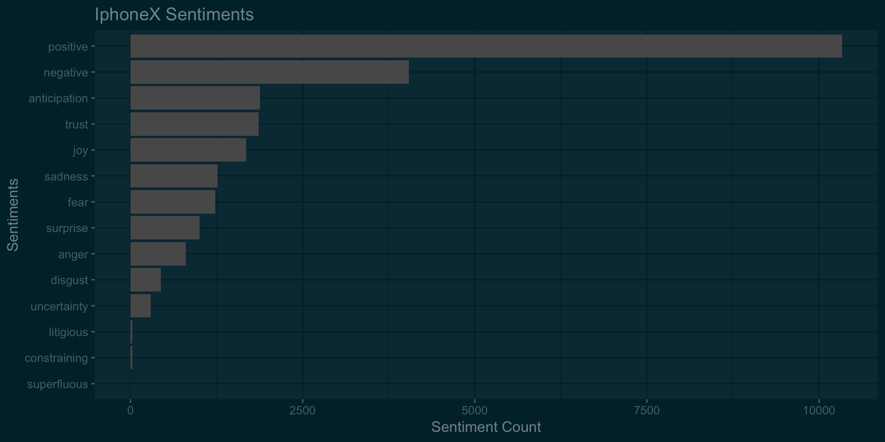

<style type="text/css">
.title {
  display: none;
}

#getting-started img {
  margin-right: 8px;
}
body{ /* Normal  */
      font-size: 14px;
  }
td {  /* Table  */
  font-size: 8px;
}
h1.title {
  font-size: 38px;
  color: DarkRed;
}
h1 { /* Header 1 */
  font-size: 28px;
  color: DarkBlue;
}
h2 { /* Header 2 */
    font-size: 22px;
  color: DarkBlue;
}
h3 { /* Header 3 */
  font-size: 18px;
  font-family: "Times New Roman", Times, serif;
  color: DarkBlue;
}
code.r{ /* Code block */
    font-size: 12px;
}
pre { /* Code block - determines code spacing between lines */
    font-size: 14px;
}

.column-left{
  float: left;
  width: 50%;
  text-align: left;
  font-size: 5;
  
}

.column-right{
  float: right;
  width: 50%;
  text-align: right;
  font-size: 5;
}

</style>

<div class="column-left">

## **Hello World!**

I am Swapnil, a Software Engineer turned analytics professional.
I have a graduate degree in Business Analytics and I enjoy solving complex
business problems using data. I love photography and cannot sleep
without watching at least one episode of **The Office!**


</div>

<div class="column-right" style="padding-bottom: 20px;>


### [Connect with me!](http://www.linkedin.com/in/swapnilsp)

</div>


```{r setup, include=FALSE}
knitr::opts_chunk$set(message=FALSE,warning=FALSE, cache=TRUE)
```
                                                                                                                
This is a repository of some of the projects I worked on. 


# ML Algorithm benchmarking

This blog is aimed at comparing top machine learning algorithm performance in solving a binary classification problem. The data used for this project pertains to bankruptcy. The objective is to predict if an organization will go bankrupt or not. False possitive predictions are penalized 15 times False negative prediction.


**Following are the alorithms that wil be considered for comparison :**


* **Logistic Regression**
* **Lasso Regression -L1 Norm Regularization**
* **Classification Tree**
* **RandomForest**
* **Generalized Additive Model**
* **Neural Nets**
* **Linear discriminant analysis** 
* **Boosting Algorithms**


<a href="binaryClassification.html">
![contnue reading..]
</a>

# Unsupervised learning

Data Science and Analytics is nowadays widely used in retail industry. With the advent of bid data tools and higher computing power, sophisticated algorithms can crunch huge volumes of transactional data to extract meaningful insights. Companies such as Kroger invest heavily to transform more than a hundred-year-old retail industry through analytics.

This project is an attempt to apply unsupervised learning algorithms on the transactional data to formulate strategies to improve the sales of the products.



**Following steps are discussed:**


* **Customer Segmentation**
* **Deciding optimum number of clustes**
* **Market Basket Analysis**

<a href="retail.html">
![contnue reading..]
</a>


# Linear Regression Diagnostics

The purpose of this project is to solve a simple problem using linear regression and understand various feature selection and model selection techniques along the way. In this project we predict the landing distance of the aircrafts based on different details. There have been many major mishaps during the landing of the aircraft, resulting in the loss of many lives.

<div class="column-left">

</div>

<div class="column-right">

</div>


**Following major steps are discussed :**

* **Exploratory Data Analysis**
* **Model building**
* **Regression model diagnostics**

<a href="landingDistance.html">
![contnue reading..]
</a>

# Hackathon

This is a code for an online hackathon to predict likelihood of someone suffering from stroke. Various algorithms are used to get predictions. Since the time was limited, the documentation in this code is sloppy.




<a href="hackathon.html">
![contnue reading..]
</a>


# Exploratory Data Analysis

Exploratory data analysis of SF Bay area **[Fordgobike](https://www.fordgobike.com/)** bike share data.

<div>

<div/>


 **Following major steps are discussed :**

* **Data cleaning**
* **Exploratory Data Analysis**
* **Implementation of interactive graphs in R**
* **Embedding Tableau workbooks in R**
* **Geospatial Analysis**
* **Business Recommendations**

<a href="fordGobike.html">
![contnue reading..]
</a>


# iPhoneX vs Galaxy Note8

This is an old analysis done sometime after both Note8 and iPhoneX were launched. One limitation of Twitter free API is that you cannot extract historical tweets. So the sentiments may not be relevant today but what the heck, data is always good for understanding the process! 
<div>

<div/>


<a href="iPhonexVsNote.html">
![contnue reading..]
</a>
***iphoneX was launched on Sep 12, 2017** and it went on sale sometime on Nov'17. Galaxy Note8 was already out a few months before iPhoneX.

# Sentiment Analysis of cryptocurrencies

There has been so much buzz about Crypto Currencies and their long-term validity these days. The world has been divided on the credibility of the Crypto Currency as an authentic investment. Some countries have even gone to the extent of banning the trade of Crypto Currencies. Let's explore what Twitterati think about this phenomenon. 

Based on the data available at **[Cryptocurrency Market Capitalizations](https://coinmarketcap.com/)**, top three Crypto Currencies with highest market capitalization were selected for analysis.

<div>

<div/>

Following three Crypto Currencies were selected-

* **Bitcoin (BTC)**
* **Ripple (XRP)**
* **Ethereum (ETH)**

<a href="cyptocurrrency.html">
![contnue reading..]
</a>

<head>
<!-- Global site tag (gtag.js) - Google Analytics -->
<script async src="https://www.googletagmanager.com/gtag/js?id=UA-145405323-1"></script>
<script>
  window.dataLayer = window.dataLayer || [];
  function gtag(){dataLayer.push(arguments);}
  gtag('js', new Date());

  gtag('config', 'UA-145405323-1');
</script>
</head>

